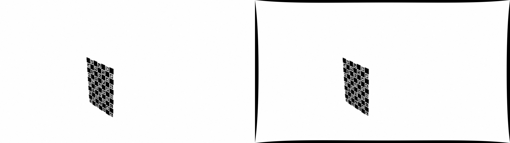
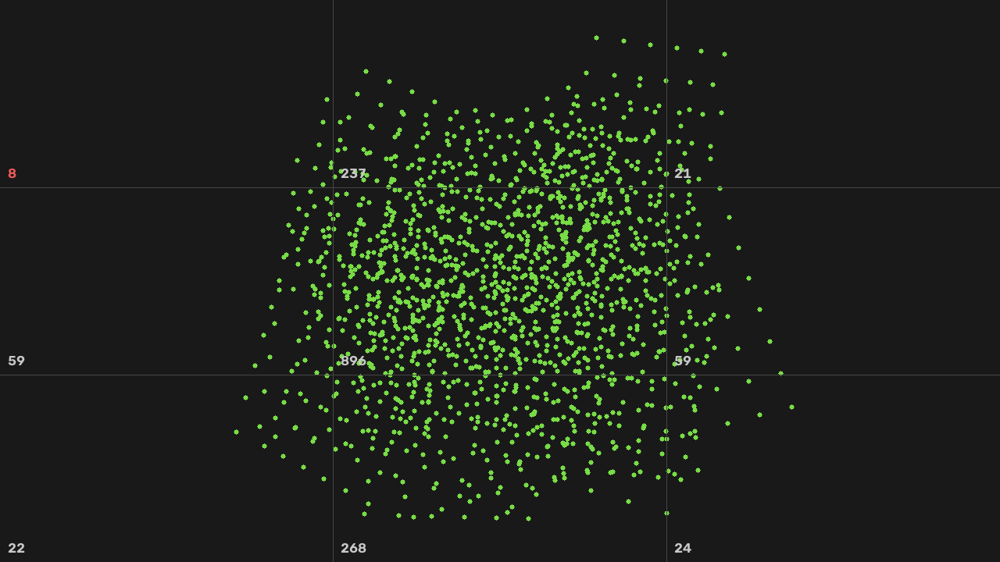

# Stage 1 — Camera Intrinsic Calibration

This stage calibrates camera intrinsics with a ChArUco board. I built a synthetic
version first so I could compare the recovered parameters with known ground
truth before relying on the same pipeline with a real webcam.

It is the first stage of the full pipeline:

`intrinsics → hand-eye calibration → PnP pose → learned keypoints → robot-level evaluation`

## Why I started with a synthetic calibration

With a real camera, I can measure reprojection error, but I do not know the true
focal length or distortion coefficients well enough to say how far the estimate
is from the physical camera. A synthetic camera gives me both: the usual
reprojection residual and the actual parameter error.

The stage therefore supports two paths:

1. **Synthetic validation** using a known camera matrix and distortion model,
   with blur, noise, and MJPG-like compression added to make the images less
   idealised.
2. **Real capture** using the same ChArUco detector and calibration code on a
   printed board and laptop webcam. This hardware run is still pending.

## Main experiment: pose coverage matters more than the lowest RMS

I rendered two 30-view datasets with the same camera and solver. The only change
was the distribution of board poses.

| Metric | Good pose spread | Frontal-only |
|---|---:|---:|
| RMS reprojection | 0.2494 px | **0.2089 px** |
| `fx` error vs truth | **0.10%** | 1.95% |
| `fy` error vs truth | 0.01% | 1.89% |
| `cy` error vs truth | 0.15% | 1.75% |
| `k1` (truth +0.115) | +0.1146 | +0.0919 |
| `k2` (truth −0.226) | −0.2147 | **+0.6267** |
| Split-half `fx` agreement | 0.18% | 3.12% |

The frontal-only dataset has the lower reprojection error, but its recovered
intrinsics are clearly worse. `k2` even changes sign.

For me, this was the first useful result in the project: reprojection error is a
fit residual, not a guarantee that the parameters are well constrained.

I added a simple split-half stability check for that reason. The even-numbered
views and odd-numbered views are calibrated independently and the recovered
intrinsics are compared. The well-covered dataset agrees closely; the
frontal-only dataset does not.

You can reproduce the comparison with:

```bash
python 00_synthetic_test.py --n 30
python 00_synthetic_test.py --n 30 --frontal-only
```

## What the calibration is doing visually



The left image is rendered with the known distortion coefficients. The right
image is undistorted using the coefficients recovered by calibration. This is a
useful visual check alongside the numerical error against ground truth.



The coverage plot shows where ChArUco corners were observed across all views.
Distortion parameters are constrained by observations across the image, so
central-only coverage leaves the model extrapolating near the edges. The real
capture tool uses the same idea in its coverage HUD.

## Handling a consumer webcam

A laptop webcam is less controlled than a machine-vision camera, so the capture
script tries to handle a few practical problems explicitly.

## Autofocus and automatic camera controls

If the webcam changes focus between frames, the effective focal length changes
and there is no single fixed intrinsic matrix that exactly describes the whole
capture. `02_capture.py` therefore attempts to lock autofocus, exposure, and
white balance.

The script also reads the properties back after setting them. Some webcam
drivers report success from `cap.set()` even when the requested value was not
actually applied.

## Motion blur

Candidate frames are checked for both sharpness and stillness. Sharpness is
measured with the variance of the Laplacian inside the detected board region,
rather than over the whole frame, so background texture does not hide a blurry
board. Stillness is estimated from the motion of matched ChArUco corner IDs.

## Pose and image coverage

The capture HUD tracks a 3×3 image grid and several board-tilt buckets. Automatic
capture prefers regions that still need samples instead of collecting many
nearly identical frontal views.

A few other webcam-specific choices are also built in:

- `CAP_DSHOW` is preferred on Windows because MSMF can ignore some property sets.
- MJPG is requested before the resolution, since some webcams otherwise fall
  back to lower resolutions under raw YUY2.
- `DICT_5X5_100` gives a little more Hamming margin on a soft/compressed image.
- ArUco bit-error thresholds are slightly relaxed for MJPG ringing.
- `k3` is fixed to zero by default because it is poorly constrained in this
  setup and can trade off against the lower-order radial terms.

## OpenCV 4.x and 5.x compatibility

OpenCV changed the shape of the ChArUco detector output between 4.x and 5.x:

| Version | Corners | IDs |
|---|---|---|
| OpenCV 4.x | `(N,1,2)` | `(N,1)` |
| OpenCV 5.x | `(N,2)` | `(N,)` |

Code that immediately reshapes corners with `.reshape(-1, 2)` is fine, while
code that assumes `corners[k, 0]` is a 2D point can silently behave incorrectly
under OpenCV 5. `board_config.detect()` normalises the shapes at the detector
boundary so the rest of the stage does not depend on the OpenCV version.

I checked the full synthetic calibration on OpenCV 4.13.0 and 5.0.0 and obtained
matching results within normal solver variation.

## Running the stage

```bash
pip install -r requirements.txt

python 00_synthetic_test.py
python 01_generate_board.py
python 02_capture.py
python 03_calibrate.py
```

`02_capture.py` uses:

- `SPACE` — capture
- `A` — automatic capture
- `U` — undo
- `Q` — quit

After printing the board, verify the 100 mm ruler on the page, mount the paper
flat on something rigid, measure a square, and update `SQUARE_LENGTH_MM` in
`board_config.py` if needed.

Board scale does not change the estimated intrinsic matrix. It does change the
scale of the recovered extrinsic translations, which matters in Stage 2, so it
is still worth measuring correctly.

## Current status

- [x] Synthetic rendering with known camera intrinsics
- [x] Good-coverage vs frontal-only calibration comparison
- [x] Split-half stability check
- [x] OpenCV 4.x / 5.x detector-shape handling
- [x] Webcam capture safeguards for focus, blur, and pose coverage
- [ ] Real webcam calibration run
- [ ] Repeatability check across multiple real capture sessions
