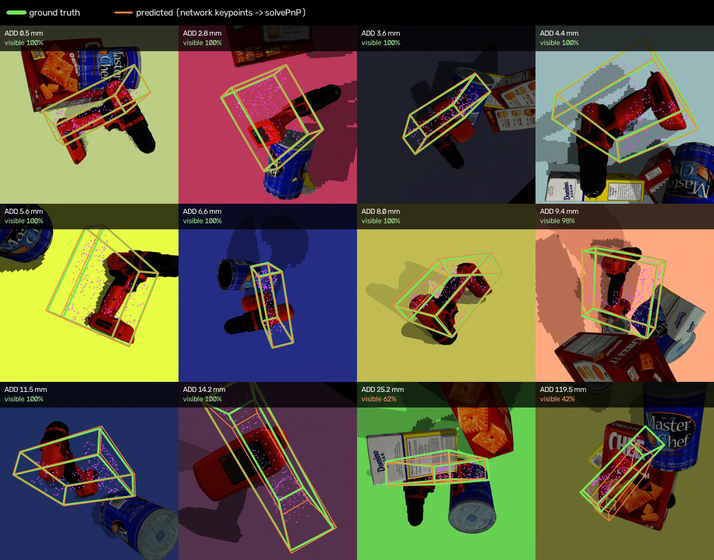
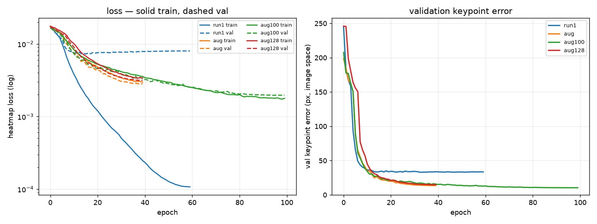

# Stage 4 — Markerless 6D Pose from Learned Keypoints

Stage 4 removes the ArUco markers used in Stage 3. A neural network predicts the
2D locations of the eight corners of the drill's 3D bounding box, and those
points are passed to the same `solvePnP` pose-recovery step.

Keeping PnP unchanged was deliberate: it lets me compare a marker-based and a
markerless perception front end without changing the geometric pose solver at
the same time.

The evaluation in this stage is synthetic. The reported numbers should therefore
be interpreted as held-out simulation performance rather than real-image or
real-robot accuracy.

---

## Final result

The test split contains 1,000 synthetic images that were not used for training
or model selection.

| Run | Main change                              | Mean keypoint error |     Mean ADD | ADD-0.1d pass |
| --- | ---------------------------------------- | ------------------: | -----------: | ------------: |
| 1   | Photometric augmentation, 64×64 heatmaps |            33.78 px |     34.79 mm |         55.5% |
| 2   | + affine + cutout                        |            14.13 px |     14.33 mm |         84.1% |
| 3   | Run 2 with 128×128 heatmaps              |            15.19 px |     15.26 mm |         83.1% |
| 4   | Run 2 with a longer 100-epoch schedule   |        **10.78 px** | **11.21 mm** |     **90.2%** |
| —   | Stage 3 ArUco baseline                   |             ~0.5 px |      1.40 mm |          100% |

The biggest gain came from augmentation, not from increasing output resolution.
Extending the training schedule after fixing the overfitting problem improved
the model further, from 14.33 mm to 11.21 mm mean ADD.

The final model is still much less precise than the fiducial baseline, which is
expected: it replaces directly detected geometric markers with image-based
predictions on an unmarked object.

The ablation table uses the original evaluation protocol so all four training
runs remain directly comparable. That protocol uses the known ground-truth
in-frame mask when deciding which keypoints are passed to PnP.

Because a deployed system does not have access to ground-truth keypoint
visibility, I also re-evaluate the final model without that information.

---

## Deployment-style evaluation

The final model was re-evaluated with:

```bash
python 05_evaluate.py \
    --ckpt checkpoints_aug100/best.pt \
    --no-oracle-mask \
    --min-conf 0.3
```

In this mode, ground-truth keypoint visibility is not used to select PnP
correspondences. Selection instead uses the peak confidence decoded from each
predicted heatmap.

| Protocol | Mean ADD | ADD-0.1d |
|---|---:|---:|
| Ground-truth in-frame mask | 11.21 mm | 90.2% |
| Confidence ≥ 0.3 | 11.37 mm | 90.1% |
| No filtering | 11.41 mm | 90.0% |

The three protocols span 0.2 percentage points of ADD-0.1d and 0.20 mm of mean ADD. Keypoint selection is therefore not what produces this result.

The keypoint error moves in the expected direction, from 10.78 px to 11.03 px.
The original protocol averages keypoint error only over keypoints known from
ground truth to be inside the image. The deployment-style protocol averages over
all eight predictions, including keypoints whose ground-truth projections lie
outside the frame.

The measured keypoint swap rate changes only slightly, from **2.04%** in the
original evaluation to **2.1%** without the ground-truth mask.

At `min-conf=0.3`, all 1,000 test images retained enough correspondences for
PnP, and `solvePnP` succeeded on **1000 / 1000** images.

The confidence value is the decoded heatmap peak, not a separately calibrated
probability. No formal probability-calibration claim is made.

---

## ADD metric definition

Pose accuracy is evaluated using Average Distance of Model Points (ADD).

For a predicted pose \((R,t)\) and ground-truth pose \((R^\*,t^\*)\),

$$
\mathrm{ADD}
=
\frac{1}{|M|}
\sum_{x \in M}
\left\|
(Rx+t)-(R^\*x+t^\*)
\right\|_2 .
$$

The ADD-0.1d success threshold is 10% of the drill mesh diameter.

For this model:

* Mesh diameter used by ADD: **226.3 mm**
* ADD-0.1d threshold: **22.63 mm**
* Axis-aligned 3D bounding-box diagonal: approximately **274.0 mm**

The 274.0 mm bounding-box diagonal is therefore not the diameter used to define
ADD-0.1d.

This distinction matters because using the larger bounding-box diagonal would
produce a looser success threshold.

---

## Occlusion is the main failure mode

For the final 100-epoch model under the original ablation protocol:

| Visibility   |   n | Mean ADD | Pass rate | Keypoint error |
| ------------ | --: | -------: | --------: | -------------: |
| Clean ≥95%   | 560 |  6.75 mm |     98.2% |        7.07 px |
| Light 70–95% | 235 | 11.46 mm |     89.8% |       11.17 px |
| Heavy <70%   | 205 | 23.07 mm |     68.8% |       20.45 px |

The degradation with visibility is much larger than the variation caused by
projected box aspect. In this synthetic test set, actual object occlusion is the
clearest measured failure mode.

The committed occlusion table counts 560 clean images; re-running now gives 558
because two records had `visible_frac` slightly above 1.0 under the old
segmentation rendering and fell outside the `< 1.01` bucket bound. Model
inference is unchanged.



The qualitative figure samples a random pool of held-out test images and spans
the ADD distribution instead of showing only the easiest examples.

* **Green** — ground-truth 3D bounding box
* **Orange** — box recovered from predicted keypoints through `solvePnP`
* **Magenta** — drill mesh vertices projected with the ground-truth pose

The bounding box looks large because the drill is L-shaped: the axis-aligned box
contains a lot of empty space around the body and handle. I therefore also draw
the mesh projection as a visual reference and verify that the projected mesh is
contained by the projected 3D box.

Across the test set, viewpoint alone is not a strong predictor of error. The
largest degradation comes from actual object occlusion.



The early run overfits clearly: training loss keeps falling while validation
performance degrades. The augmentation-heavy training behaves much better and
supports a longer schedule without the same separation.

---

## What I tested and what I learned

A useful part of this stage was that several explanations I expected to be true
did not survive measurement.

### 1. Corner identity was not the main bottleneck

The keypoints are corners of a 3D bounding box, so many of them lie in empty
image regions and have no unique local texture. I initially expected the model
to confuse corner identities frequently.

I split the error into localisation and identity components by matching each
prediction to the nearest ground-truth corner.

| Run | Localisation component | Identity component | Swap rate |
| --- | ---------------------: | -----------------: | --------: |
| 1   |                24.5 px |             9.3 px |     14.5% |
| 2   |                13.2 px |             1.0 px |      3.3% |
| 4   |                10.3 px |            ~0.5 px | **2.04%** |

The larger problem was basic localisation. As the model became more accurate,
most identity mistakes also disappeared without changing the keypoint
definition.

Under the deployment-style evaluation without the ground-truth visibility mask,
the final-model swap rate is **2.1%**, so removing the mask does not materially
change this conclusion.

---

### 2. RANSAC barely helped

If the main failure mode had been a few cleanly swapped points, RANSAC should
have been a natural fix. A simple simulation using the measured swap rate
suggested a large improvement.

On the actual run-1 predictions, it did not happen. Least squares gives 34.79 mm
mean ADD and a 55.5% pass rate (`results/eval_test_base.json`); switching to
`solvePnPRansac` with a 40 px reprojection threshold moved the mean ADD to
36.31 mm, marginally worse.

The reason is that swapped points were not otherwise accurate outliers. They
were also noisy, so they did not form the clean inlier/outlier structure assumed
by the toy simulation.

The RANSAC run is not committed as a result file, so 36.31 mm comes from my
experimental notes rather than a stored result artifact in this repository.

I also learned that the RANSAC threshold has to be set against the measured
keypoint noise. My first 12 px threshold was smaller than the typical error and
rejected too many useful points.

---

### 3. Higher heatmap resolution was not the missing precision

At 64×64, one heatmap pixel corresponds to 10 pixels in the original 640×640
image. That made quantisation look like an obvious limitation.

The 128×128 experiment did not improve the result: 15.19 px keypoint error vs
14.13 px at 64×64, with more computation.

The first 128×128 run actually failed completely because I kept the Gaussian
sigma fixed at 2 heatmap pixels. Doubling the heatmap size while keeping sigma
fixed reduced the positive target area by roughly four times, and the network
collapsed toward predicting background everywhere.

| Heatmap / sigma | Positive fraction |
| --------------- | ----------------: |
| 64, σ=2.0       |            0.513% |
| 128, σ=2.0      |            0.128% |
| 128, σ=4.0      |            0.421% |

`sigma_for()` now scales sigma with the heatmap size so the target has roughly
the same width in original-image pixels. The reported 128×128 result is from
that corrected experiment.

---

### 4. View geometry mattered less than I expected

For the final model:

| Projected box aspect |   n | Mean ADD | ADD-0.1d pass |
| -------------------- | --: | -------: | ------------: |
| Edge-on <0.35        | 101 | 14.28 mm |         87.1% |
| Oblique 0.35–0.6     | 352 | 10.37 mm |         91.2% |
| Broad >0.6           | 547 | 11.17 mm |         90.1% |

There is some variation, but nothing close to the gap created by heavy
occlusion.

The near edge-on samples that looked suspicious during label checking were
generally valid and did not become a dominant PnP-conditioning failure.

---

## Keypoint definition

The network predicts the eight corners of the drill's axis-aligned 3D bounding
box in the object frame.

Across the **28 unique pairs** of distinct box corners, the mean pairwise
separation is approximately **196.2 mm**.

The axis-aligned bounding-box diagonal is approximately **274.0 mm**.

These widely separated 3D correspondences provide PnP with a geometrically
spread point set.

The previously reported value of 171.7 mm resulted from averaging the complete
8×8 distance matrix, including the eight zero self-distances. When "mean
pairwise separation" refers to the unique pairs of distinct keypoints, the
appropriate value is approximately 196.2 mm.

Bounding-box corners are common in 6D-pose methods such as BB8 and YOLO-6D. In
this project they provide a simple, deterministic keypoint definition, although
the synthetic evaluation here should not be read as a direct leaderboard
comparison with those datasets or methods.

An important limitation is that these are 3D bounding-box corners rather than
surface landmarks. Depending on the viewpoint, some projected corners lie in
empty image regions around the L-shaped drill or outside the image itself. The
network therefore sometimes has to infer a geometrically defined point rather
than localise a directly visible physical feature.

---

## Synthetic renderer

`01_render.py` generates 640×640 training images and labels.

Randomised properties include:

* Object pose, sampled uniformly on SO(3) with quaternions
* Camera position on a dome and random camera roll
* Ambient light and one or two directional lights
* Floor colour
* Zero to four YCB distractor objects
* Camera field of view within ±3°

The drill texture and output resolution are kept fixed.

The renderer is intended to expose the model to variation in pose, illumination,
background, camera geometry, and partial occlusion while retaining exact
ground-truth camera and object pose.

---

## Occlusion is measured rather than avoided

Each image stores `visible_frac`, measured with segmentation renders before and
after distractors are added. This lets one dataset support both clean and
occluded evaluation subsets.

I use a few constraints to stop hard examples from turning into unusable labels:

* `MIN_VISIBLE_FRAC = 0.35` — at least 35% of the drill's own projected area
  must remain visible.
* `MIN_VISIBLE_PX = 6000` — an absolute pixel-area floor prevents tiny distant
  objects from passing the ratio test.
* `KP_MARGIN = 15 px`, `MAX_KP_OUTSIDE = 2` — a small number of bounding-box
  corners may leave the image, but not by a large amount.
* `MIN_SEPARATION = 0.055 m` — distractors cannot be spawned inside the drill
  mesh.

One renderer bug is worth documenting. I originally measured visibility for one
random distractor arrangement and then randomised the distractors again before
saving the final RGB image. The stored `visible_frac` therefore described the
wrong scene.

The renderer now stores the measured object poses and restores exactly those
poses for the final render.

Current generation also constrains the stored visibility fraction to its
physically meaningful range.

A typical generated dataset has about 87% mean visibility, around 44% of images
with some occlusion, and about 20% below 70% visibility. The render rejection
rate is roughly 9%.

---

## Chunked generation

```bash
python 00_fetch_assets.py

python 01_render.py --n 2000 --start-idx 0
python 01_render.py --n 2000 --start-idx 2000
# ... 4000, 6000, 8000

python 02_build_dataset.py --val 1000 --test 1000
```

The random seed defaults to `--start-idx`, so independently generated chunks do
not repeat the same pose sequence.

`02_build_dataset.py` checks duplicate seeds and filenames and confirms that
every manifest entry has an image.

Train, validation, and test splits are stratified by occlusion so their
difficulty distributions remain similar.

---

## Label verification

```bash
python 01_render.py \
    --n 12 \
    --start-idx 0 \
    --debug \
    --out debug_data

python 03_verify_labels.py \
    --data debug_data \
    --n 12 \
    --save
```

I found two important dataset issues only by looking at rendered examples: the
missing absolute pixel-area floor and an overly generous keypoint frame margin.

Both looked acceptable in aggregate statistics.

Visual inspection is not enough either. `03_verify_labels.py` projects the true
drill mesh using the stored pose and verifies a hard geometric invariant: the
mesh projection must lie inside the projection of the 3D bounding box that
contains it.

There is still one known limitation in this verifier: it compares metadata and
geometry but does not prove that the RGB file on disk is the exact image that
belongs to the manifest record.

A mistyped `--start-idx` once overwrote about 100 images without breaking the
metadata checks. The renderer is deterministic from the seed, so re-rendering
the affected range repaired the dataset.

---

## Model

The model is a ResNet-18 pretrained on ImageNet followed by deconvolution blocks
that produce eight heatmaps.

| Coordinate space | Size             | Purpose                                       |
| ---------------- | ---------------- | --------------------------------------------- |
| Image            | 640×640          | Stored keypoints and stored camera matrix `K` |
| Network input    | 256×256          | Resized RGB input                             |
| Heatmap          | 64×64 by default | Keypoint targets and predictions              |

Decoded predictions are scaled back into the original 640×640 image coordinates
before PnP so they remain consistent with the stored camera matrix.

Each output heatmap represents one fixed 3D bounding-box corner identity.

---

## Why heatmaps instead of direct coordinate regression

A convolutional network naturally preserves spatial information.

Heatmaps keep that representation spatial until decoding instead of asking the
final layer to store x/y position only in activation values.

They also provide a spatial peak that can be refined below integer
heatmap-pixel resolution before the coordinates are passed to PnP.

---

## Sub-pixel decoding

A plain argmax is limited to integer heatmap pixels. At 64×64 that would mean
10-pixel steps in the 640×640 image, which is too coarse for accurate PnP.

The decoder fits a quadratic to the log heatmap values around the peak along
both axes.

On an ideal Gaussian this recovers the peak exactly, and under added heatmap
noise it consistently improves over integer argmax:

| Heatmap noise σ | Argmax only |    Sub-pixel |
| --------------- | ----------: | -----------: |
| 0.00            |    0.376 px | **0.000 px** |
| 0.05            |    0.511 px | **0.254 px** |
| 0.10            |    0.677 px | **0.453 px** |
| 0.20            |    1.056 px | **0.827 px** |

These values are in heatmap pixels; multiply by 10 for original-image pixels at
64×64.

---

## Loss

Training uses masked MSE on sigmoid heatmaps with `pos_weight=8`.

The targets are mostly background, so the positive weighting helps prevent the
trivial solution of predicting no keypoints everywhere.

Keypoints that fall outside the heatmap are masked out instead of being trained
against an all-zero target.

That avoids teaching the network that a point near the image border should be
actively suppressed just because its true centre is slightly outside the frame.

The masking used when creating the training loss is separate from the
deployment-style evaluation above, where ground-truth visibility is not used to
select PnP correspondences.

---

## Augmentation

Training augmentation includes:

* Photometric changes: brightness, contrast, colour cast, sensor noise, defocus
* In-plane affine transforms: scale, translation, and rotation
* Cutout rectangles to increase robustness to partial occlusion

The affine code was tested with synthetic blobs and keeps transformed image
points and keypoints aligned to about 0.095 px.

Horizontal flipping is intentionally excluded.

A mirror image of this chiral object is not generally equivalent to a valid 3D
rotation of the original object, so using flips would create labels that do not
correspond to the physical pose problem.

Validation and test images are not augmented, which keeps their stored pose and
camera matrix valid for PnP.

---

## Training

```bash
python 04_train.py \
    --epochs 40 \
    --patience 8 \
    --aug 1.0 \
    --tag aug

python 04_train.py \
    --epochs 40 \
    --patience 8 \
    --aug 1.0 \
    --heatmap 128 \
    --batch 16 \
    --tag aug128

python 04_train.py \
    --epochs 100 \
    --aug 1.0 \
    --tag aug100
```

Checkpoints are written each epoch to:

```text
checkpoints_<tag>/last.pt
```

with the best validation checkpoint saved as:

```text
checkpoints_<tag>/best.pt
```

Resume mode restores the model, optimizer, scheduler, epoch, and best validation
score.

Validation uses mean keypoint error in original-image pixels rather than heatmap
MSE.

Pixel error is easier to compare across runs and is directly related to the
accuracy available to PnP.

If resuming a cosine-annealed run, keep the total `--epochs` value consistent
with the schedule used to create the checkpoint.

Changing `T_max` mid-run causes a learning-rate discontinuity, so the script
warns about it.

On the development machine (RTX 4060 laptop), a 64×64-heatmap epoch takes about
45 seconds with four data workers; 128×128 takes about 60 seconds.

---

## Evaluation and figures

### Original ablation protocol

```bash
python 05_evaluate.py \
    --ckpt checkpoints_aug100/best.pt
```

This reproduces the protocol used for the training ablation table.

### Deployment-style protocol

```bash
python 05_evaluate.py \
    --ckpt checkpoints_aug100/best.pt \
    --no-oracle-mask \
    --min-conf 0.3
```

This removes the ground-truth in-frame mask from PnP correspondence selection.

For the final model:

```text
Mean keypoint error : 11.03 px
Mean ADD            : 11.37 mm
ADD-0.1d pass       : 90.1%
PnP solved          : 1000 / 1000
Swap rate           : 2.1%
```

The evaluator reports keypoint error, ADD, ADD-0.1d pass rate, PnP solve count,
swap/localisation breakdowns, and performance by visibility and projected box
aspect.

---

## Qualitative evaluation

```bash
python 06_qualitative.py \
    --ckpt checkpoints_aug100/best.pt \
    --mesh \
    --out results/qualitative_mesh.png

python 07_plot_training.py
```

The qualitative script samples randomly rather than taking `records[:N]`.

Earlier dataset construction grouped records by occlusion level, so taking the
first records produced a figure dominated by the hardest bucket.

The split builder now shuffles after stratification as well.

The qualitative visualisation is intended as a diagnostic complement to the
quantitative metrics rather than evidence selected only from successful cases.

---

## What the reported numbers mean

The final markerless result under the controlled ablation protocol is:

```text
90.2% ADD-0.1d
11.21 mm mean ADD
10.78 px mean keypoint error
```

The deployment-style result without ground-truth keypoint selection is:

```text
90.1% ADD-0.1d
11.37 mm mean ADD
11.03 px mean keypoint error
1000 / 1000 PnP solves
```

Both results are measured on **1,000 held-out synthetic images**.

They are therefore results for the synthetic Stage 4 pose-estimation benchmark,
not claims of:

* 90% real-world pose accuracy
* 90% robotic grasp success
* 90% real-image performance
* generalisation to unseen physical environments

The next step required to make those stronger claims is real-image and
sim-to-real validation.

---

## Known limitations

### Synthetic-to-real gap

Training and evaluation are currently synthetic.

Domain randomisation exposes the model to substantial simulated variation, but
it does not prove transfer to real cameras, materials, lighting, lens effects,
motion blur, or physical clutter.

Real-image evaluation remains the main missing validation step.

### Bounding-box keypoints are partly virtual

The eight predicted points are corners of a 3D bounding box, not necessarily
visible physical landmarks.

Some projected corners therefore occur in empty space or outside the image,
which requires the network to infer their positions from visible object
geometry.

### Occlusion remains difficult

Heavy occlusion produces a substantially larger accuracy drop than viewpoint
variation.

This is the strongest measured failure mode in the current synthetic test set.

### Stage 3 remains substantially more precise

The ArUco-based Stage 3 baseline achieves approximately 1.40 mm mean ADD,
compared with approximately 11 mm for the final learned-keypoint system.

Stage 4 therefore demonstrates successful marker removal, not improved
precision over fiducial markers.

---

## Main conclusions

The experiments support several conclusions:

1. **Data augmentation mattered more than increasing heatmap resolution.**

   Adding geometric augmentation and cutout improved mean ADD from 34.79 mm to
   14.33 mm, while increasing heatmap resolution from 64×64 to 128×128 did not
   improve accuracy.

2. **Longer training became useful after controlling overfitting.**

   The final 100-epoch model reduced mean ADD to 11.21 mm under the controlled
   ablation protocol.

3. **Basic localisation error mattered more than keypoint identity swaps.**

   The final controlled-evaluation swap rate is **2.04%**, while the remaining
   localisation error is much larger.

4. **RANSAC did not solve the original failure mode.**

   Prediction errors were not clean isolated outliers, so robust PnP did not
   provide the improvement suggested by a simplified swap simulation.

5. **Occlusion matters more than projected box aspect.**

   Heavy occlusion produces the largest measured degradation.

6. **Keypoint selection barely affects the final pose result.**

   ADD-0.1d is 90.2% using the ground-truth in-frame mask, 90.1% using
   predicted confidence at 0.3, and 90.0% with no filtering at all. The whole
   spread is 0.2 points, so the evaluation protocol is not carrying this
   result. For run 1, with a 14.5% swap rate, selection would likely have
   mattered more.

7. **The learned front end remains much less precise than the marker baseline.**

   This is expected because Stage 4 replaces directly detected fiducial geometry
   with image-based prediction on an unmarked object.

---

## Status

* [x] Fixed 3D keypoint definition
* [x] Domain-randomised renderer with measured occlusion
* [x] Chunked generation and stratified train/val/test splits
* [x] ResNet-18 heatmap model with sub-pixel decoding
* [x] Training checkpoints, resume, scheduling, and early-stopping support
* [x] Inference → PnP → ADD evaluation against the Stage 3 marker baseline
* [x] Augmentation ablation
* [x] Heatmap-resolution ablation
* [x] Longer 100-epoch training run
* [x] Deployment-style evaluation without ground-truth PnP masking
* [x] Confirmed 1000 / 1000 PnP solves at `min-conf=0.3`
* [x] Corrected unique keypoint-pair separation calculation
* [x] Distinguished ADD mesh diameter from bounding-box diagonal
* [ ] Real-image / sim-to-real evaluation

---

## Current Stage 4 result

The final markerless pose-estimation model was evaluated under three keypoint-selection protocols on a held-out test set of **1,000 synthetic images**:

| Protocol | Mean ADD | ADD-0.1d |
|---|---:|---:|
| Ground-truth in-frame mask | 11.21 mm | 90.2% |
| Confidence ≥ 0.3 | 11.37 mm | 90.1% |
| No filtering | 11.41 mm | 90.0% |

The original controlled protocol also gives **10.78 px** mean keypoint error and a **2.04%** keypoint swap rate. With the ground-truth mask removed and confidence threshold set to 0.3, mean keypoint error is **11.03 px**, the swap rate is **2.1%**, and PnP solves **1000 / 1000** images.

Across the three keypoint-selection protocols, ADD-0.1d spans only **0.2 percentage points** and mean ADD spans **0.20 mm**. For the final model, keypoint selection therefore has little effect on downstream pose accuracy.

The remaining major validation step is testing the complete perception pipeline on real images.
